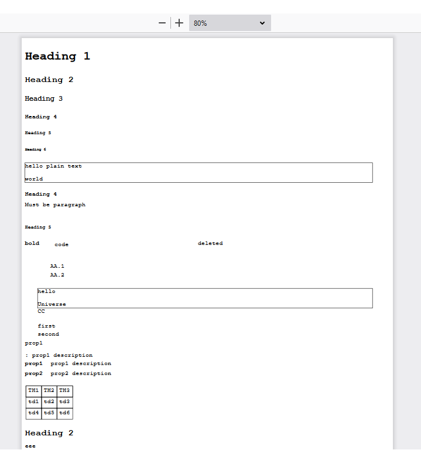

# Markdown -> PDF

Experiment in converting Markdown to PDF, via [Sciter](https://sciter.com)'s [Markdown example](https://github.com/c-smile/sciter-sdk/tree/master/samples/markdown/GitHub) with the [binding for libharu](https://github.com/4silvertooth/sciter-pdf).

Very much :construction: WIP :construction:.

## Instructions

After placing [scapp.exe](https://github.com/c-smile/sciter-sdk/tree/master/bin.win) and [sciter-pdf.dll](https://github.com/4silvertooth/sciter-pdf/releases) in this folder, run `scapp.exe`.

